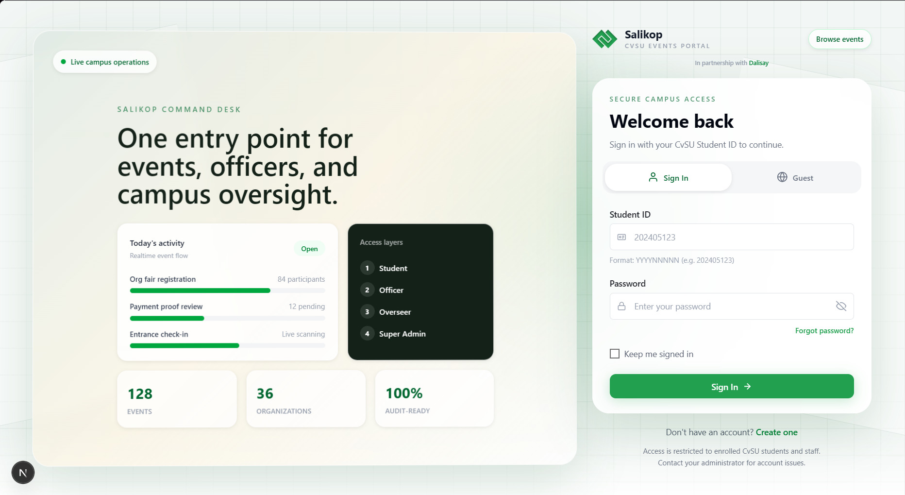
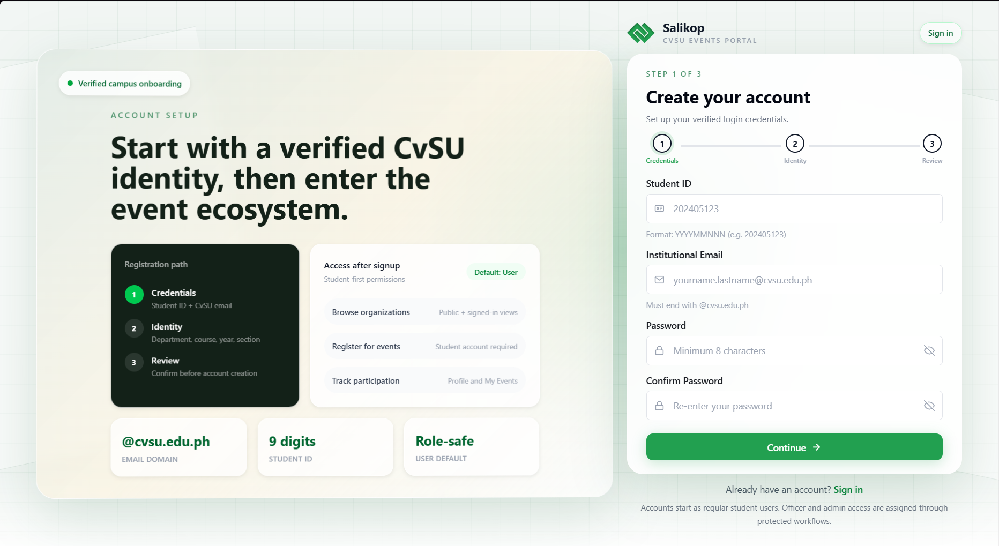
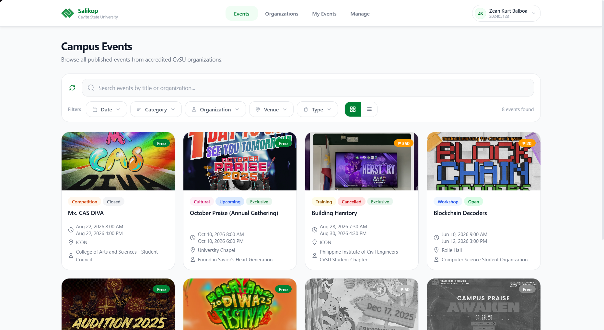
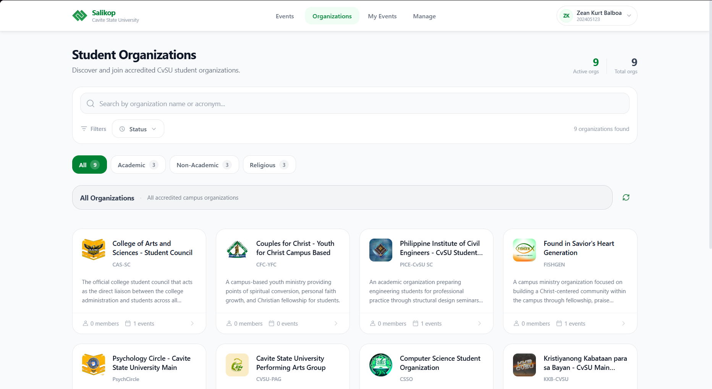
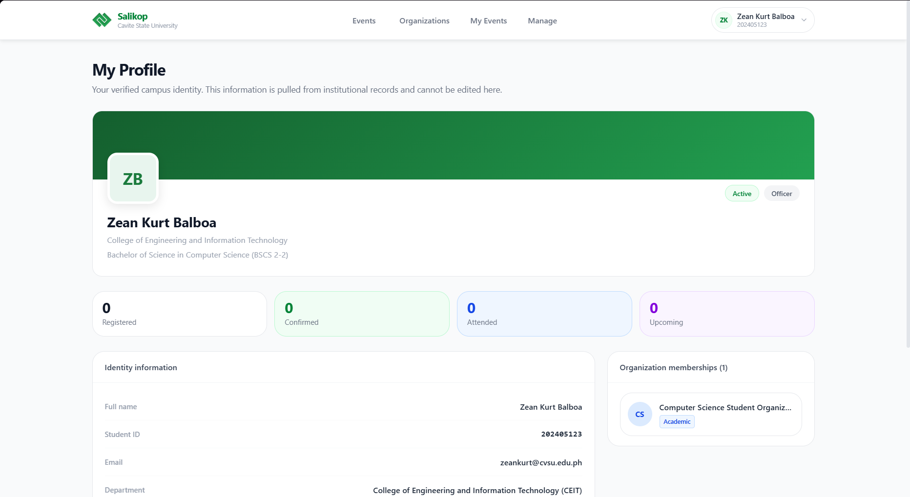

# Salikop

  <strong>Centralized Campus Organization and Event Management System</strong>

  A database-driven web platform for managing campus organizations, memberships, events, registrations, and administrative workflows in one system.

  
  
  
  
  

---

## Overview

Salikop is a web-based platform built to centralize how campus organizations operate, how memberships are managed, and how students interact with campus events. It replaces scattered manual processes such as social media-only announcements, paper sign-up sheets, fragmented membership tracking, and paper-based payment verification with one unified workflow for students, organization officers, and administrators.

The system is designed around practical campus operations:

- event discovery and registration
- organization visibility and membership management
- officer-side event and participant management
- administrative oversight for users, organizations, and system activity

---

## Purpose

Salikop aims to improve campus coordination by giving student organizations and campus administrators a single environment for event operations, registrations, visibility, and verification. The system is intended to reduce manual errors, make event participation easier to manage, and provide a more consistent digital workflow across campus activities.

---

## Preview

<table>
  <tr>
    <td width="50%">
      
       
      Login interface
    </td>
    <td width="50%">
      
       
      Sign-up interface
    </td>
  </tr>
  <tr>
    <td width="50%">
      
       
      Events catalog
    </td>
    <td width="50%">
      
       
      Organization directory
    </td>
  </tr>
  <tr>
    <td colspan="2">
      
       
      User profile
    </td>
  </tr>
</table>

---

## Core Features

### Student Experience

- Browse campus events from one central catalog
- View complete event details before registration
- Track joined and registered events
- Manage profile information and account access

### Organization and Membership Workflows

- Public organization directory for Academic, Non-Academic, and Religious groups
- Membership-related workflows for tracking and managing organization participation
- Support for organization member records and membership status handling
- Structured organization profiles with clearer visibility for campus users

### Officer Tools

- Create and manage events
- Manage organization memberships and member-related workflows
- Review participants and registration records
- Verify payments and event-related submissions
- Operate through dedicated management views and dashboards

### Administrative Oversight

- Manage organizations, users, and events
- Oversee membership-related records and organization activity
- Review organization status and system activity
- Support broader campus-level coordination and control

---

## User Roles

- `Guest`: Browse public events and organization information
- `Student`: Register for events, track participation, and manage profile data
- `Organization Officer`: Manage memberships, events, participants, and verification workflows
- `Administrator / Overseer`: Manage users, organizations, memberships, events, and oversight functions

---

## System Modules

- Authentication and User Management
- Organization and Membership Management
- Event Catalog and Event Management
- Participant Registration and Tracking
- Payment Verification and Attendance Support
- Notifications and Administrative Oversight

---

## Tech Stack

| Layer | Technology |
| --- | --- |
| Frontend | Next.js, React, Tailwind CSS, TypeScript |
| Backend | Laravel, PHP |
| Database | MySQL |
| Tooling | npm workspaces, Concurrently |

---

## Project Context

- `Course Requirement`: DCIT 55 - Advanced Database Management System
- `Professor`: Mark Mina
- `Institution`: Cavite State University - Main Campus, Indang, Cavite
- `Program`: Bachelor of Science in Computer Science (BSCS 2-2)
- `Project Type`: Database-driven web application

---

## Team

- `Zean Kurt G. Balboa` - Lead Developer / Full-Stack Developer / Release Manager
- `Kurt Oswill McCarver` - Lead Frontend Developer / UI Implementation
- `Lawrence Rain Ibasco` - Database Architect / System Analyst / Documentation Lead
- `Raphael A. Reyes` - QA Tester / Documentation Specialist / Usability Reviewer

---

## Workspace Structure

- [`app`](/d:/zeank/Desktop/Projects/centralized-campus-org-event-management/app) - Salikop frontend application
- [`backend`](/d:/zeank/Desktop/Projects/centralized-campus-org-event-management/backend) - Laravel backend API and server-side logic
